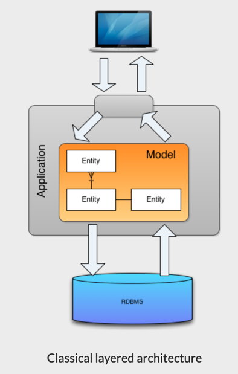
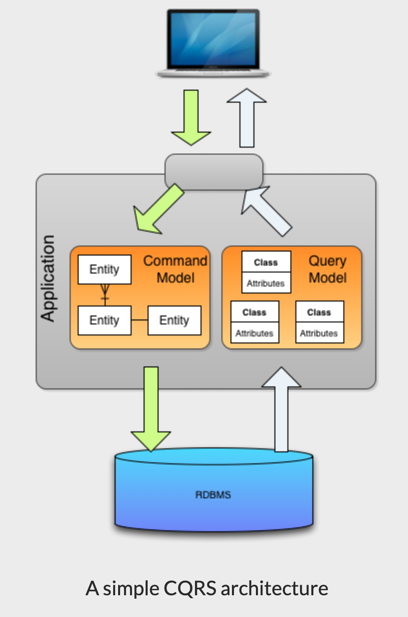
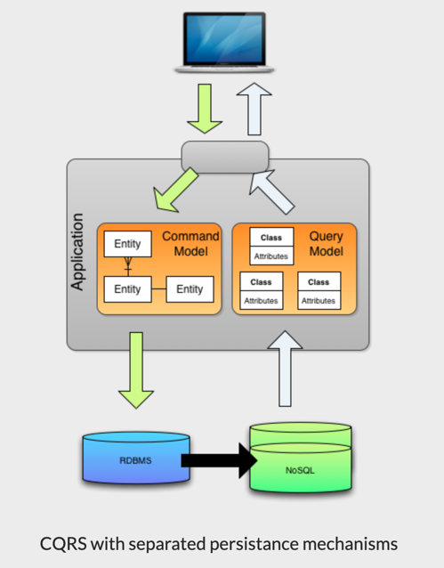
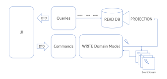

# CQRS
- Command Query Responsibility Segregation
- 명령과 쿼리의 책임 분리
  - Command : Create, Update, Delete
  - Query : Read

## 배경
- 서비스 규모가 커짐에 따라 **도메인 모델의 복잡도가 높아짐** 
- 정책 또는 제약을 반영하는 **데이터 조작의 Command** 와 **단순 조회를 수행하는 Query** 가 **동일 도메인 모델에 존재하며 복잡도는 더욱 높아짐**
- 명령(Command)과 조회(Query)가 **함께 있음으로서 발생하는 문제들을 해결하기 위한 방법**으로서 **CQRS가 등장**했다.

## CQRS 단계

### 전통적인 계층 구조

 _- 출처 : http://auconsil.blogspot.com/2013/08/cqrs-command-query-responsibility.html_
- 전통적인 계층 구조는 위와 같이 **단일 DB**와 **Model**과의 연결 구조로 되어있다.
- 해당 계층 구조에서 CQRS 를 적용하기 위한 방법은 크게 3가지로 구분 된다.

### 1. Simple CQRS architecture

 _- 출처 : http://auconsil.blogspot.com/2013/08/cqrs-command-query-responsibility.html_
- DB는 분리하지 않고 기존 구조 그대로 유지
- Model Layer 만 Command/Query Model로 분리한 수준
- 장점
  - 구현/적용하기 쉽다.
- 단점
  - 동일 DB를 사용하기 때문에 성능상 문제점을 개선하지 못한다.

### 2. CQRS with seperated persistence mechanisms

 _- 출처 : http://auconsil.blogspot.com/2013/08/cqrs-command-query-responsibility.html_
- Command 용 DB와 Query 용 DB를 분리하여 별도의 Broker를 통해 이 둘 간의 데이터 동기화를 처리하는 방식
- 데이터 조회(Query) 서비스들은 조회에 적합한 DB를 사용할 수 있기에 Polyglot(= 다수 DB 혼용 사용) 구조로 구성 할 수 있다.
- 장점
  - 각 도메인 모델에 맞는 DB를 튜닝하여 사용할 수 있기 때문에 성능상의 문제해결 가능
- 단점
  - 동기화 처리를 위한 Broker 의 가용성과 신뢰도가 보장되어야 하는 Risk 존재

### 3. EventSourcing Model

 - 출처 : https://kariera.future-processing.pl/blog/cqrs-simple-architecture
- 이벤트 소싱 적용
  - 이벤트 소싱이란?
    - Application 내의 모든 활동을 이벤트로 전환해서 이벤트 스트림을 별도의 DB에 저장하는 방식을 말한다.
    - 이벤트 스트림을 저장하는 DB에는 오직 데이터 INSERT 만 가능하다.
    - 축적된 활동 데이터를 바탕으로 구체화를 통해 조회대상 데이터를 추출한다.
- 이벤트 소싱의 이벤트 스트림은 오직 INSERT 만 가능하고(Command), 필요 시점에 구체화 단계를 통해 조회(Query) 데이터가 생성된다는 관점에서 CQRS 의 모델 분리 관점에 잘 맞기 때문에 주로 선택한다.
- CQRS 패턴에 이벤트 소싱은 필수가 아니지만, 이벤트 소싱에 CQRS 는 필수

## 참고
- http://auconsil.blogspot.com/2013/08/cqrs-command-query-responsibility.html