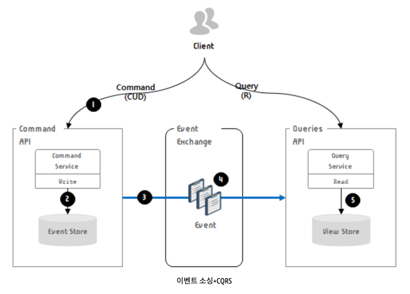

# Event Sourcing

## Event Sourcing 이란?

- 데이터 저장 방식 중 하나로 발생한 이벤트를 저장하는 기법
- Application 내의 모든 활동을 이벤트로 전환해서 이벤트 스트림을 별도의 DB에 저장하는 방식을 말한다.
- 이벤트 스트림을 저장하는 DB에는 오직 데이터 INSERT 만 가능하다.
- 축적된 활동 데이터를 바탕으로 구체화를 통해 조회대상 데이터를 추출한다.

## 사용 이유

- 전통적인 방식은 **Aggregate 에 대한 이력이 없음**
- MSA 에서는 각 서비스마다 각자의 데이터를 가지게 되면서 **데이터 정합성을 보장하기 어려워짐**
- 따라서 데이터를 가진 **서비스가 바로 데이터를 조작하게 하면 안 됨**
- 이를 해결하기 위해 **서비스는 이벤트를 발행**하고, **event store 에 저장**
- **이벤트 커슈머가** 해당 이벤트를 DB or HDFS 에 들어온 순서대로 적재하고 **필요 데이터를 변경함**
- 이벤트 소싱은 클라우드에서 구동되는 **메시지 중심의 분산 시스템에 적합**

## 특징

- 이벤트를 재생하면 특정 애그리거트 상태를 그대로 재연할 수 있음.
    - 그렇다면 매번 특정값을 읽어오기 위해 이벤트들을 재생해야 하는 것인가?
        - 이벤트 소싱은 쓰기에 적합하지만 읽기에 매우 비효율적인 구조.
        - CQRS (Command and Query Responsibility Segregation)를 적용하면 읽기 성능을 높일 수 있음
            - Command 로 Event 를 쌓고, 리드 모델에서 조회 (저장은 Event로 하지만 조회는 구체화된 데이터를 대상으로 수행)
                - 리드 모델 : 이벤트 버스를 통해 전파된 이벤트를 이벤트 리스너가 케치하여 리드 모델을 갱신한다.

## Event Sourcing + CQRS

 _- 출처 : https://june-coder.tistory.com/32_

1. Command가 발생하면 `commmand API`에 요청 전달
2. Command를 처리하는 서비스는 `event store`에 api 처리 결과를 저장
3. 이벤트가 처리된 후 `이벤트 브로커`로 결과가 전송
4. 이벤트는 제한적이며, 이벤트 기반의 독립적인 형태로 **통합**됨
5. 이 이벤트는 `queries API`로 전달되며 `view store`에 저장됨. 이후 `client`로부터 **query가 요청되면** `view store`에 **동기화된 데이터를 조회**하게 됨

## 단점

- 새로운 프로그래밍 모델에 대한 지식이 필요하다.
    - 메시지 기반 에플리케이션의 복잡성
        - 메시지 브로커가 적어도 1회 이상 전달하므로 멱등하지 않은 이벤트 핸들러는 중복 이벤트를 감지해 걸려내야 함.
            - cf. 멱등성 : 연산을 여러 번 적용하더라도 결과가 달라지지 않는 성질
    - 이벤트를 발전시키기 어렵다.
        - 이벤트 스키마는 시간이 지나면서 발전됨.
        - 이벤트는 영구 저장되므로 각 스키마 버전별로 이벤트를 폴드해야 함. 이를 위해서는 버전마다 분기처리하는 코드가 필요.
        - 스키마 변화 관리
            - **전통적인 방식** : Migration. 변경된 새 스키마에 기존 데이터를 옮겨 담음.
            - **이벤트 소싱** : 이벤트 소싱 프레임워크가 알아서 처리. Upcaster라 하는 컴포넌트가 개별 이벤트를 구 버전에서 신 버전으로 업데이트.
    - 데이터 삭제가 어려움
        - 개인정보와 같은 반드시 삭제되어야 하는 데이터가 존재
        - 그러나 애그리거트의 이력 보존이 이벤트 소싱의 주요 목표이므로 데이터는 영구적으로 저장됨.
        - 따라서 삭제하기가 어려움 -> 대안으로 **암호화** 적용
            - **사용자마다 암호 키를 발급**해서 별도의 DB 테이블에 저장. 사용자 개인 정보가 포함된 이벤트는 이벤트 저장소에 저장하기 전에 암호화.
            - 사용자가 삭제를 요청하면 DB 테이블에 있는 **암호화 키 레코드만 삭제**
    - 이벤트 저장소를 쿼리하기 어렵다
      > 예) 신용 한도가 소진된 고객 찾기
      > - 전통적인 방식 : select * from customer where credit_limit = 0
      > - 이벤트 소싱 : 처음에 신용 한도를 설정한 이후 업데이트한 이벤트를 폴드해서 신용 한도를 계산. (중첩된 select 문을 사용해 복잡하고 비효율적인 쿼리를 쓸 수 밖에 없음.)

## 참고

- https://june-coder.tistory.com/32