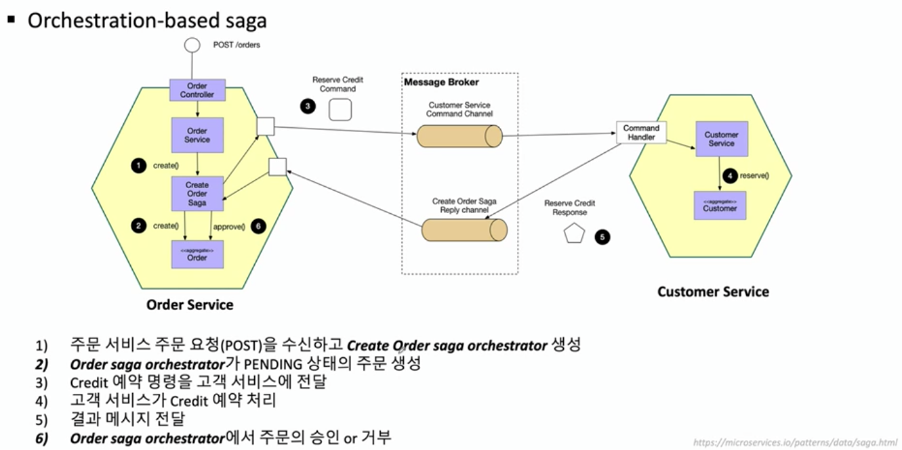

# MSA Patterns

- Event Sourcing
- CQRS Pattern
- Saga Pattern

## Event Sourcing
- 데이터의 마지막 상태뿐만 아니라 수행된 전체 이력을 기록 (Update/Delete X, Only Insert)
- 데이터 구조 단순화
- 데이터의 일관성과 트랜잭션 처리 가능
- 데이터 저장소의 개체를 직접 업데이트 하지 않기 때문에, 동시성에 대한 충돌 문제 해결
- 도메인 주도 설계
  - 데이터의 상태를 바꾸기 위한 Aggregate 방
  - 현제 가지고 있는 데이터의 상태값을 보여주는 Projection
- 메시지 중심의 비동기 작업 처리
- 단점
  - 모든 이벤트에 대한 복원 -> 스냅샷을 통해 해결 
  - 다양한 데이터 조회 -> CQRS을 통해 해결

## CQRS
- Command and Query Responsibility Segregation
- 명령과 조회의 책임 분리
  - 상태를 변경하는 Command
  - 조회를 담당하는 Query

> 우리가 Database로부터 데이터를 읽어오고 처리를 하게 되면
  이미 그 사이에 데이터가 변경이 되었을 가능성이 높다.
  CQRS는 이런 변경 가능성을 인정하고 어차피 Read와 CUD 사이에는 delay가 존재할 수 있음을 인정하는 것이다.
  이를 통해서 R과 CUD를 구분함으로써 얻는 이점을 설명하는 것이 CQRS패턴이다.
- [CQRS 적용 단계](https://www.popit.kr/cqrs-eventsourcing/)

## Saga pattern
: 분산 애플리케이션의 일관성을 유지하고 여러 마이크로서비스 간의 트랜잭션을 조정하여 데이터 일관성을 유지하는데 도움이 되는 장애 관리 패턴
- Application 에서 Transaction 처리
  - Choreography(안무), Orchestration(지휘)
- Application 이 분리된 경우에는 각각의 Local transaction 만 처리
- 각 App 에 대한 연속적인 Transaction 에서 실패할 경우
  - Rollback 처리 구현 -> 보상 Transaction
- 데이터의 원자성을 보장하지 않지만, 일관성을 보장

### Choreography-based saga
- 무용수들이 자신의 역할을 알고 주변 다른 무용수에 반응하는 것과 같은 시스템
- 

### Orchestration-based saga
- 빈약한 CRUD 기반의 서비스에 할 일을 지시하는 소수의 똑똑한 '신'과 같은 서비스를 낳는 것

- Choreography VS Orchestration 주요 차이점
  - Choreography : 마이크로서비스간의 데이터를 서로 주고 받음
  - Orchestration : 중앙에 있는 Message Broker 를 통해 모든 통신을 처리

## 참고

- [Spring Cloud로 개발하는 마이크로서비스 애플리케이션(MSA) - Dowon Lee](https://www.inflearn.com/course/%EC%8A%A4%ED%94%84%EB%A7%81-%ED%81%B4%EB%9D%BC%EC%9A%B0%EB%93%9C-%EB%A7%88%EC%9D%B4%ED%81%AC%EB%A1%9C%EC%84%9C%EB%B9%84%EC%8A%A4/)