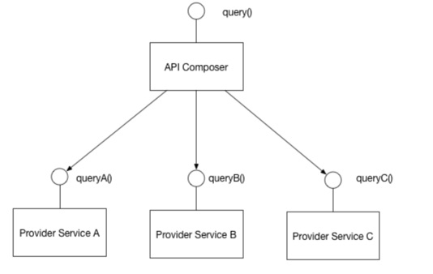

# API 조합기

## 배경

- MSA 를 적용하면 Micro Service 마다의 Database 가 존재하게 된다.
- 이렇게 된 이상 분리된 여러 서비스들에게 join 쿼리를 직접적으로 호출할 수 없게 된다.

## 해결 방법

- `API Composer` 를 통해 쿼리를 구현한다.
- `API Composer` 는 `data` 를 소유하고 있는 서비스들을 호출하고, 결과에 대해 `in-memory join` 을 수행한다.

 _- 출처 : https://microservices.io/patterns/data/api-composition.html

- `API Gateway`가 종종 `API Composer` 역할을 수행할 때도 있다.

## 장단점

### 장점

- 간단한 방법으로 MSA 환경에서 join 쿼리 를 수행할 수 있음.

### 단점

- 대용량 쿼리의 경우 `in-memory join` 으로 인한 성능 문제가 있을 수 있다.

### 관련 패턴들

- [분산 DB 설계](https://github.com/TonyJev93/Study/blob/main/Architecture/MSA/%EB%B6%84%EC%82%B0%EB%8D%B0%EC%9D%B4%ED%84%B0%EC%BF%BC%EB%A6%AC/%EB%B6%84%EC%82%B0DB%EC%A1%B0%ED%9A%8C%EC%84%A4%EA%B3%84/%EB%B6%84%EC%82%B0-DB-%EC%A1%B0%ED%9A%8C-%EC%84%A4%EA%B3%84.md)
- [CQRS 패턴](https://github.com/TonyJev93/Study/blob/main/Architecture/CQRS/CQRS.md)

## 참고

- https://microservices.io/patterns/data/api-composition.html