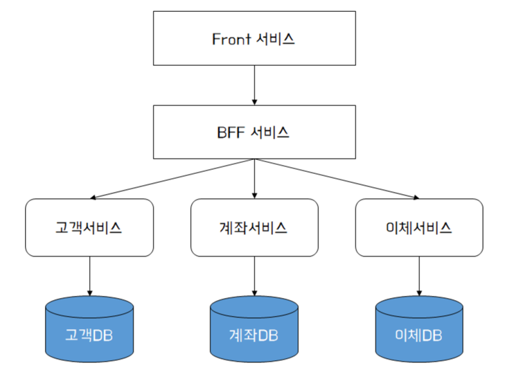
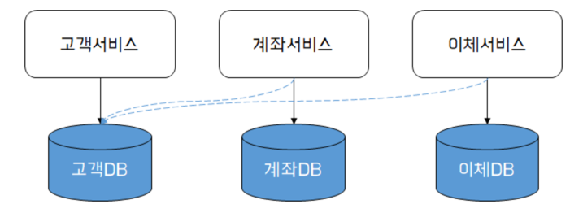
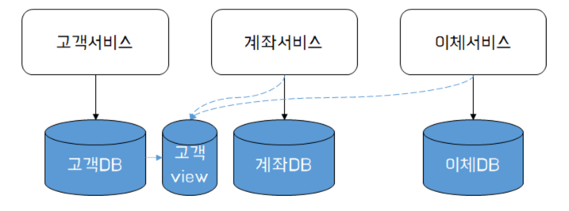
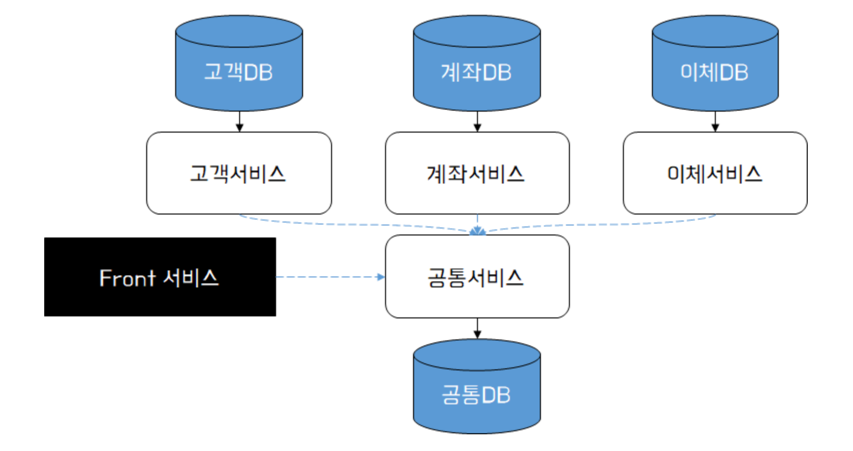
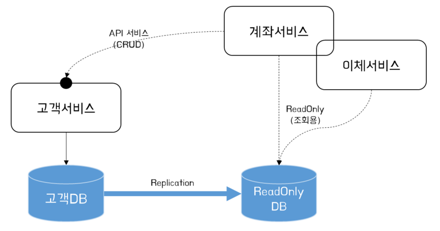

# 분산 DB 조회 설계

## DB 분리 기준

- **참고** : [마이크로서비스 아키텍처의 기준과 DB 분리](https://waspro.tistory.com/718) (읽어보는 것을 추천)
- MSA 라고 해서 반드시 DB를 분리해야 하는 것은 아님
- 리스크를 최소화 하며 MSA 전환하기 위한 순서 : `백앤드` - `DB` - `프론트엔드`
- 설계 과정에서의 순서 : `어플리케이션` - `인터페이스` - `Data`
    - 어플리케이션(API), 인터페이스의 변화는 개발 과정에서 감당할 수 있는 수준의 변화
    - 데이터의 변화는 MSA 전체를 재설계 해야할 만큼 중대한 변화
    - 따라서, 초기 데이터의 변화를 정확히 파악하고 비즈니스를 개선해 나가는 것이 무엇보다 중요

## MSA 에서 데이터베이스 분리시 고려사항

    - 데이터 동기화 문제
    - 논리적 스키마 vs 물리적 스키마 분해
    - 트랜잭션 무결성
    - 조인
    - 대기 시간

## 다양한 분산 DB 설계 패턴

- [단일 DB 패턴](#단일-DB-패턴)
- [마이크로서비스 간 독립 DB 사용](#마이크로서비스-간-독립-DB-사용)
- [데이터 공유 방식 (View)](#데이터-공유-방식-view)
- [공통 마이크로서비스 활용](#공통-마이크로서비스-활용)
- [ReadOnly DB 활용](#readonly-db-활용)

### 단일 DB 패턴

- MSA 에서의 단일 DB 사용시 문제점은 아래와 같다.
    - 마이크로서비스 간 정보 보호(은닉)의 어려움
    - 데이터 통제의 어려움
    - 결합도 증가에 따른 서비스 배포 독립성 확보 불가

### 마이크로서비스 간 독립 DB 사용

 _- 출처 : https://waspro.tistory.com/724_

- **특징**
    - 각 마이크로서비스가 자체 데이터를 소유
    - 비즈니스를 서비스 내에서 처리
    - 고객이 가장 선호하는 패턴
- 신규 서비스를 위와 같이 설계하는 것은 가장 바람직한 설계 방법
- But, 이미 운영중인 서비스가 존재하는 경우 결합도를 끊어 내고 마이크로 서비스로 전환하는 것은 굉장히 어려운 작업
    - 비즈니스 대부분을 수정하여 서비스를 재분류하는 작업부터 시작되어야 함
- **장점**
    - 각 서비스 간의 독립적 스키마 사용을 통한 낮은 결합도
    - 서비스가 추구하는 **목표(성능, 배포 독립성, 비즈니스 요구사항, 독립 데이터 소유 등)에 맞게 설계 가능**
- 위 장점은 필요가 아닌 충분조건이기 때문에 모든 서비스를 한번에 전환하기 보다는 순서를 정하고 분리해 나가는 것이 좋다.

### 데이터 공유 방식 (View)

- 완전한 DB의 분리가 불가능한 경우 차선책
- 하나의 서비스가 2개 이상의 DB에 접근하는 것을 허용하는 방법
- 독립적인 DB를 가지고 있는 서로 다른 서비스가 서로의 Data 에 접근해야 하는 경우 DB에 직접 접근하기 보다는 View를 통해 결합도를 낮출 수 있음
- View 사용시 노출 가능 데이터를 제한함으로써 데이터 은닉을 가능케 한다.

> - 타 서비스 데이터소스에 직접 접근하는 형태 _(출처 : https://waspro.tistory.com/724)_  
    > 

- 위와 같이 구성할 경우 공유하는 서비스간 결합도가 높아지는 문제 발생
- 고객 DB가 변경 될 경우 이를 참조하는 서비스들 또한 변경된 데이터 또는 스키마에 대한 검증이 수행되어야 함

> - 모든 외부서비스를 위한 조회용 View 스키마 제공하는 형태 _(출처 : https://waspro.tistory.com/724)_  
    > 

- View 가 유지되는 한 고객 DB의 자체 스키마를 변경해도 나머지 서비스에 영향을 주지 않는다.
- 또한, 불필요 데이터를 숨기거나, 테이블 조인을 수행한 결과를 View 로서 제공할 수 있다.
- **View 사용시 유의할 점**
    - 데이터 정합성 문제
        - View 는 일반적으로 캐시를 사용하여 미리 계산된 결과를 보관한다.
        - 이는 조회 성능 향상에 도움이 됨
        - 그러나 동기화 되지 않은 오래된 데이터를 읽어 올 수 있음을 고려해야 함
        - **View 를 갱신하는 방식**이 성능과 데이터 정합성 사이의 중요한 요소이다.
    - 기존 DB와 View 의 동일 데이터베이스 사용
        - 기존 DB와 View 가 Schema 는 분리가 되었지만 여전히 동일한 데이터베이스 엔진 내에 있어야 함
        - 즉, 타 서비스가 DB에 직접 접근하는 것보다는 결합도를 낮출 수 있지만, 여전히 CUD와 R이 동일 데이터베이스에서 이루어지고 있음을 인지 해야 함
- 그렇다면 언제 사용하면 좋을까?
    - 단일 DB 내 계정이 분리되어 있는 환경
    - 현행 스키마를 `모델링`을 통해 분해하기 어려운 경우

### 공통 마이크로서비스 활용

 _- 출처 : https://waspro.tistory.com/724_

- 공통 서비스를 별도로 구현하여 공유 데이터(Shared Data)를 관리하는 방식
- 공통서비스는 Front 서비스에 공통 데이터 접근을 위한 엔드포인트를 제공
- 공통서비스 - 마이크로서비스 간에는 공통 데이터 조회를 위한 API 제공
- API 형태로 서비스 호출하여 Schema 를 분리하기 위한 초입단계로서 적용해 볼 만한 설계
- **장점**
    - API 호출을 통한 DB 독립성 유지가 가능한 가장 선호되는 방식
    - 데이터의 실시간성이 보장됨

### ReadOnly DB 활용

 _- 출처 : https://waspro.tistory.com/724_

- 타 마이크로서비스에 CUD 하는 경우에는 API 호출, 조회하는 경우 ReadOnly DB 이용하는 방식
- CUD 된 데이터를 ReadOnly DB로 복제하여 사용
    - 복제로 인한 시간차 이슈에 유의하여 설계 필요
- DB 복제 방법은 DB 에서 지원하는 Replication 방식을 사용할 수 있지만, 이기종 DB간 지원, Schema 변경에 대한 대응을 위해 CDC(Change Data Capture) 도구(ex. OGG,
  Debezium ...)를 사용하는 것을 권장함
- **장점**
    - 데이터 보호
    - 읽기 전용에 특화된 DB(ex. NoSQL ..)를 활용하여 성능상 이점 확보
    - CQRS or API Composition 을 위한 조회 용도 DB 활용 가능
- **단점**
    - 데이터 정합성에 신경써야함

---- 

## 참고

- [마이크로서비스 분산DB 조회 설계](https://waspro.tistory.com/724?category=857035)