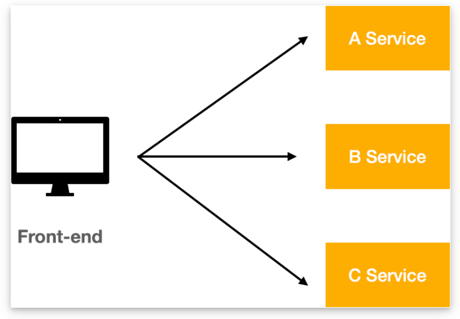
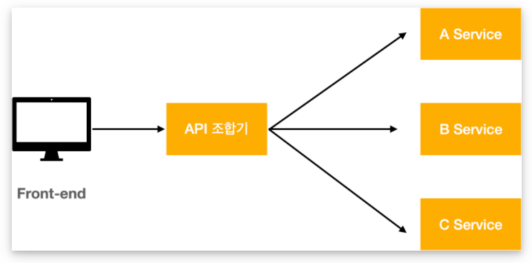
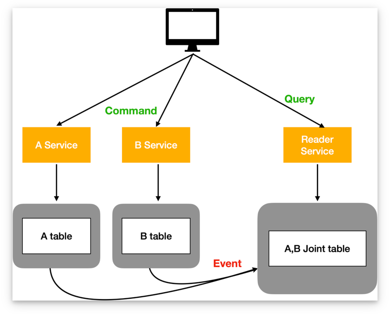

# 분산 데이터 쿼리하기

- MSA 환경에서 여러 도메인의 조합된 데이터를 조회하는 방법에 대해 알아보자.

## API 조합 패턴

- MSA 환경에서 조합된 데이터를 얻기 위해서는 여러 서비스를 호출하여 데이터를 받아와야 한다.
   
    _- 출처 : https://taes-k.github.io/2020/11/22/msa-5/_

- API 조합 패턴은 `API 조합기`를 클라이언트와 마이크로 서비스 사이에 두어 서비스로부터 받아온 데이터를 대신 조합하여 클라이언트에게 전달해주는 방식이다.
   
    _- 출처 : https://taes-k.github.io/2020/11/22/msa-5/_

- `API 조합기`는 모놀리식 아키텍처에서 수행하던  `DB Join` 작업을 `In-memory Join`을 통해 수행하게 된다.
- 이는 **메모리 데이터 로드에 한계**가 있기에 `대용량 데이터 Join` 이 필요한 경우 다른 형식의 데이터 Join 을 고안해야 한다.

### API 조합기 위치

1. `Client Webserver` : 클라이언트와 같은 LAN을 사용하므로 가장 효율적으로 서비스 호출 가능
2. `API Gateway` : 현재 서비스에 API 게이트웨이가 적용 되어있는 경우 사용 가능
3. `별도 Service` : MSA 서비스가 많고 데이터 처리 로직이 복잡한 경우 별도 서비스 구축 추천

### 유의점

1. **빠른 응답**
    - `API 조합기` 제공 API 는 클라이언트에서 직접 호출하기 때문에 이 보장 되어야 함.
    - 여러 서비스들을 호출하여 조합하기 때문에 `Blocking` 수행 시 응답속도에 치명적일 수 있음.
    - 가능하다면 `Reactive model`을 사용하여 `Non-blocking`으로 병렬 호출하는 것을 권장
2. **오버헤드 증가**
    - `모놀리식`의 경우 한번의 호출로 얻을 수 있는 결과를 `MSA`는 여러 서비스를 호출해야 하기 때문에 전체적인 오버헤드 증가가 발생함.
3. **낮은 가용성**
    - 서비스가 많아짐에 따라 가용성이 떨어짐
    - 서비스 불능이 발생했을 때 캐시를 통해 대처하거나, 미완성 데이터라도 응답하는 방식으로 가용성을 높여 줄 수는 있음.
4. **데이터 일관성 보장 어려움**
    - 조회 및 변경이 하나의 DB 트랜잭션을 통해 수행되지 않기 때문에 `isolation(고립성)` 보장되지 않음.
    - 이에 따라 부정확한 데이터를 응답 받을 수 있음.

## CQRS 패턴

- [CQRS 란?](https://github.com/TonyJev93/Study/blob/main/Architecture/CQRS/CQRS.md)
- `API 조합 패턴`의 경우 매번 호출할 때 마다 여러 서비스들로부터 데이터를 가져와 조합하면서 성능상의 이슈나 복잡한 데이터 조합 사용의 어려움이 발생
- `CQRS`는 조합이 필요한 데이터들을 DB 또는 ES 등의 데이터저장소에 **미리 구성해두고 사용**하기 때문에 해당 이슈를 해결할 수 있다.
   
    _- 출처 : https://taes-k.github.io/2020/11/22/msa-5/_
### 장점
- 효율적 쿼리 사용
- 다양한 쿼리 사용
- 이벤트 소싱 패턴 사용
- 관심사 분리

### 단점
- Read 전용 데이터소스(View)를 구성하기 위한 별도의 서비스 개발 필요
- 복잡한 아키텍처
- 데이터 복제로 인한 시차 발생

### CQRS View 구축
- View 구성요소
  1. 저장소 선택
     - `CQRS View`는 `Read` 전용으로 사용되기 때문에 `RDB`만 고집할 필요 없다.
     - 상황에 따라 유연하게 저장소를 선택할 수 있다.
       > - JSON 객체 검색 -> 문서형 스토어 (MongoDB, DynamoDB …)
       > - 키값 검색 -> Key-value 스토어 (Redis …)
       > - 텍스트 쿼리 -> 검색엔진 (Elastic search, Solar …)
       > - 그래프 쿼리 -> 그래프 DB (Neo4j …)
       > - SQL 리포팅, BI -> RDB (MySQL, Oracle …)
  2. 이벤트 핸들러 작업
     - 데이터 동기화를 위한 `이벤트 핸들러` 작업 필요
     - 실제 데이터 변경건을 실시간으로 반영하지 못하기 때문에 실제 데이터와의 시차가 있을 수 있음
  3. 데이터 조회 API 서비스 구축

## MSA 간 독립 DB 사용

## 데이터 공유 방식 (View)

## 공통 마이크로서비스 활용

## ReadOnly DB 활용