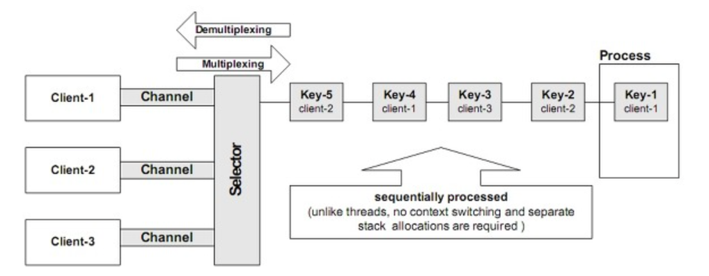

# 병렬 프로그래밍 (JAVA)

## 개요

- 자바에서 제공하는 저수준의 도구와 설계 수준의 정책 간 차이점을 극복할 수 있도록 병렬 프로그래밍을 작성하는데 필요한 간결한 규칙이 필요하다.
- 자바 메모리 모델의 깊숙한 부분까지 이해하면서 병렬 프로그램을 작성하면 좋겠지만, 그러한 상세 내용을 모르더라도 올바르게 동작하는 병렬 프로그램을 작성할 수 있어야 한다.
- 병렬 프로그래밍과 관련된 간결한 규칙을 잘 따르면 올바르고 유지보수도 간편한 병렬 프로그램 작성이 가능하다.

## 필요한 배경지식

- 동기화 관련
    - 자바 동기화 입문서 The Java Programming Language 쓰레드 관련 부분
    - Concurrent Programming in Java 참고

## 소개

- OS 는 여러개의 프로그램을 각자의 Process 내에서 **동시에 실행할 수 있도록 발전** 되었음.
- Process 는 각자가 **서로 격리된 채로 독립적으로 실행**된다.
- OS 는 Process 마다 `메모리, 파일 핸들, 보안권한` 등의 자원을 할당한다.
- Process 끼리는 서로 통신할 수 있는데 `소켓, 시그널 핸들러, 공유 메모리, 세마 포어, 파일` 등 비교적 큰 단위의 다양한 통신 수단이 제공된다.

### 작업 동시 수행의 역사

- 여러 프로그램을 동시에 실행할 수 있는 운영체제를 개발하게 된 몇 가지 요인
    - 자원 활용
        - 특정 프로그램이 응답을 기다리는 동안 다른 프로그램을 실행함으로써 자원을 더욱 효율적으로 사용하기 위함.
    - 공정성
        - 여러 사용자와 프로그램이 컴퓨터 내 자원에 대해 동일한 권한을 가질 수 있어야 함.
        - 한 번에 한 프로그램을 끝까지 실행하기 보다는, 작은 단위로 여러 프로그램을 수행하여 컴퓨터를 공유하는 방법이 바람직하다.
    - 편의성
        - 여러 작업을 전부 처리하는 하나의 프로그램을 작성하기 보다, 각기 일을 하나씩 처리하는 프로그램을 작성하여 필요할 때 프로그램 간에 조율을 통해 사용하는 편이 더 쉽고 바람직하다.

## 쓰레드 (가벼운 프로세스 : Lightweight Process)

- 쓰레드를 통해 한 프로세스 안에 여러 개의 프로그램 제어흐름이 공존할 수 있게 됨.
- 쓰레드는 메모리, 파일 핸들과 같이 **프로세스에 할당된 자원을 공유**하며, 동시에 각 쓰레드는 **각기 별도의 프로그램 카운터, 스택, 지역 변수를 갖는다**.
- **프로그램을 쓰레드로 분리**하면 멀티프로세서 시스템에서 **하드웨어 병렬성을 이용**할 수 있다.
    - 한 프로그램을 여러 쓰레드에 의해 동작하도록 하였음.
    - 각 쓰레드를 여러 CPU 에 할당하여 실행.
    - 현대 OS 의 대부분은 프로세스가 아닌 쓰레드를 기본 단위로 CPU 자원의 스케쥴링 한다.
    - 별도 조율이 없는 한 하나의 쓰레드는 다른 쓰레드와 상관없이 비동기적으로 실행 됨.
- 쓰레드는 자신이 포함된 프로세스의 메모리 주소를 공유
    - 동일 프로세스 내 모든 쓰레드는 같은 변수에 접근하고 같은 힙에 객체를 할당 함.
    - 이를 통해 쓰레드는 프로세스보다 더욱 세밀한 단위의 데이터 공유가 가능
    - 그러나, 공유 데이터에 접근하는 과정을 적절하게 동기화하지 않으면 다른 쓰레드가 사용중인 변수를 순간적으로 수정하여 예상치 않은 결과가 나올 수 있다.

### 쓰레드의 이점

- 잘 사용할 경우 **유지보수 비용 감소**와 복잡한 에플리케이션의 **성능을 향상** 할 수 있음.
- JVM 을 더 단순하게 구현할 수 있도록 도와줌.
    - 가비지 컬렉터는 보통 하나 또는 두 개 이상의 전용 쓰레드에서 실행 됨.

#### 1) 멀티 프로세스 활용

- 쓰레드 하나로 동작하는 프로그램은 최대 하나의 프로세서만 사용 가능하다.
- 프로세서가 두 개인 시스템에서 쓰레드가 하나뿐인 프로그램을 실행하면 CPU 자원의 50% 를 낭비하는 샘
- 더 나아가 프로세서가 100개면 99% 낭비하는 샘
- 제대로 설계하기만 하면 멀티쓰레드 프로그램은 가용한 프로세스 자원을 더 효율적으로 이용하여 처리속도를 향상 시킬 수 있다.

#### 2) 단순한 모델링

- `스케쥴링, 교차 실행되는 작업, 비동기 I/O, 자원 대기` 등의 세부적인 부분과 상위 비즈니스 로직에 해당하는 부분을 분리할 수 있음.
- 복잡한 비동기적 작업 흐름을 각기 별도의 쓰레드에서 수행되는 **단순하고 동기적인 작업 흐름 몇개로 분리**할 수 있음. 이러한 작업 흐름에서는 특정한 동기화 시점에서만 상호 작용이 발생한다.
- 이런 장점은 서블릿이나 RMI(Remote Method Invocation)와 같은 프레임워크에서 종종 활용 됨.
    - 프레임워크는 `요청 관리, 스레드 생성, 로드 밸런싱`, 그리고 작업 흐름 내에서 `적절한 시점에 적절한 애플리케이션 컴포넌트에게 요청을 분배`하는 등의 상세한 부분을 처리함.
    - 서블릿 개발자는 웹 요청이 들어와 서블릿이 `Service Method`를 호출할 때 마치 해당 과정을 단일 스레드 프로그램인 것 처럼 처리할 수 있다.
- 즉, 작업에 있어 `단일 책임을 분리`하는 용도로 쓰레드가 사용 될 수 있다.

#### 3) 단순한 비동기 이벤트 처리


<br>_- 출처 : https://12bme.tistory.com/63_

- 여러 클라이언트의 소켓 연결을 받는 서버 애플리케이션의 경우 각 연결마다 쓰레드를 할당하고 동기 I/O를 사용하도록 하면 개발 작업이 쉬워짐.
- 단일 쓰레드 서버 프로그램의 경우 훨씬 복잡한 실수하기 쉬운 Non-Blocking I/O 기능을 사용해야 한다.
- 하지만, 각 요청을 별개의 쓰레드에서 처리하면 대기 상태에 들어가도 쓰레드가 요청을 처리하는 데는 별 영향을 끼치지 않는다.
- 표준 JAVA API 에서도 대기 상태에 들어가지 않는 I/O 를 지원할 수 있도록 java.nio 같은 패키지가 추가되었다.
- 하지만, OS 에서 더 많은 쓰레드를 지원하게 됨에 따라, 일부 플랫폼에서는 다수의 클라이언트에 대해서도 클라이언트마다 쓰레드를 하나씩 생성하는 일이 현실적인 경우가 많아 졌다.

#### 4) 더 빨리 반응하는 UI(사용자 인터페이스)

- MAX(이벤트 쓰레드 작업시간) = UI 반응속도
- 즉, 쓰레드가 몇개든지 간에 가장 오래걸리는 쓰레드의 작업시간이 곧 UI 의 반응속도가 된다.
- 그렇기 때문에 이벤트 쓰레드에서 짧은 작업만 실행한다면, 빠른 UI 반응속도를 얻을 수 있다.

## 쓰레드 사용의 위험성

- 발전하는 언어 및 라이브러리, 플랫폼 측면에서 쓰레드 사용이 쉬워짐에 따라 이를 사용하는 개발자의 역할이 중요해 짐.
- 개발자는 `쓰레드 안정성(Thread Safety)`에 대해 잘 알고 사용하여야 한다.

### 1) 안정성(Safety) 위해 요소

- UnsafeSequence 는 비표준 어노테이션인 `@NotThreadSafe`를 사용 한다.(cf. `@NotThreadSafe`는 `@ThreadSafe`와 `@Immutable`과 같은 클래스 수준의
  어노테이션이다.)
    - 만약 `@ThreadSafe`가 붙은 경우 해당 클래스 사용에 있어 멀티쓰레드 환경에서 문제가 없음을 명확히 할 수 있다. 또한 해당 클래스를 유지보수하는데 있어서 쓰레드 안정성이 계속 보장돼야 함을
      주의할 수 있다.
- 쓰레드는 동일 메모리 주소 공간을 공유하고 동시에 실행되기 때문에 다른 쓰레드가 사용중일 지도 모르는 자원을 사용할 수 있다.
- `공유 자원 사용`은 `쓰레드간의 통신 방식`보다 훨씬 편의한 이점이 있으나, 동시에 위험요소를 제공하기도 한다.
    - = 경쟁 조건(Race condition)
- 멀티쓰레드 프로그램이 동작하는 모습을 예측가능하려면 쓰레드간 서로 간섭하지 않도록 공유된 변수에 접근하는 시점에 적절한 조율이 필요.
    - JAVA 에서는 공유 변수 접근을 조율하기 위한 동기화 수단이 제공되고 있다.
- 아래는 UnsafeSequence 를 바로 잡으려는 방법 중 하나이다.

```java

@ThreadSafe

public class Sequence {
    @GuardedBy("this")
    private int value;

    // 스레드 안전한 일련번호 생성
    public synchronized int getNext() {
        return value;
    }
}
```

- getNext 를 동기화된 메소드로 만들어 문제를 해결하였다.
- 동기화를 하지 않으면 `컴파일러, 하드웨어, 실행 환경` 각각에서 명령어 실행 시점이나 실행 순서가 자유로워 짐. 또한 `레지스터`나 다른 쓰레드에 일시적으로 보이지 않는 `프로세서 별 캐시 메모리`에 변수를
  캐시할 수 도 있음.
- 이는 성능 향상에 도움이 되기도 하지만, 개발자가 잘 모르고 사용할 경우 오히려 최적화 작업으로 인해 프로그램에 오류가 발생하므로 주의해서 쓰레드 간에 데이터 공유가 되고있는지에 대해 명확히 구분하여 사용하자.

### 2) 활동성(liveness) 위험

- 멀티쓰레드 사용 시 단일 쓰레드 프로그램에서는 발생하지 않는 활동성(liveness) 장애가 발생할 수 있다.
- `안정성`은 `"잘못된 일이 생기지 않는다"`인 반면, `활동성(liveness)`이란 `"원하는 일이 결국 일어난다."`는 보완적인 목표에 관한 것이다.
    - 어떠한 작업이 전혀 진전되지 못하는 상태에 빠질 때 활동성 장애가 발생했다고 함.
    - 활동성 장애 = `교착 상태(Deadlock)`, `기아상태(Starvation)`, `라이브락(Livelock)` 등
        - 교착 상태(Deadlock) : 두 개 이상의 작업이 서로 상대방의 작업이 끝나기만을 기다리는 상태
        - 기아상태(Starvation) : 특정 프로세스의 우선순위가 낮아 계속해서 원하는 자원을 할당받지 못하는 상태
        - 라이브락(Livelock) : 이미 점유된 자원의 사용을 위해 무한정 대기하는 상태
- 활동성 장애를 일으키는 오류는 초기에 파악하기 어려움. 각기 다른 쓰레드에서 실행되는 작업의 상대적인 타이밍에 따라 활동성 장애가 나타나기 때문에 개발이나 테스트 도중에 잘 드러나지 않는다.

### 3) 성능 위험

- 잘 설계된 병렬 프로그램의 경우 쓰레드를 통해 성능향상을 얻을 수 있다.
- 반면, 쓰레드가 많은 프로그램에서는 `컨텍스트 스위칭`이 빈번하게 발생 하여 오히려 많은 부하가 발생할 수 있다.
- 부하를 일으키는 요소는 다음과 같다.
    - 실행중인 컨텍스트를 저장하고 다시 읽어야 함.
    - 메모리를 읽고 쓰는데 있어 지역성(locality)이 손실됨.
    - 쓰레드를 실행하기도 버거운 CPU 시간을 스케쥴링 하는데 소모해야 함.
    - 쓰레드간 데이터 공유를 위해 동기화 수단도 사용해야 함.
- 이는 아래와 같은 문제들을 일으킨다.
    - 컴파일러 최적화 방해
    - 메모리 캐시 삭제 및 무효화
    - 공유 메모리 버스에 동기화 관련 트래픽 유발

---

## 고찰

- 병렬 프로그래밍 사용에 익숙하지 않은 상태에서 위와 같은 내용들을 모른 상태로 사용하게 됐을 경우, 성능 향상은 커녕 오히려 장애 발생을 유발할 수 있다는 것을 알게 되었다.
- 병렬 프로그래밍에 대해 `기본 지식`을 갖추고 이를 활용한 `라이브러리`를 사용하는 것이 올바른 사용이 될 것 같고, 아무리 병렬 프로그래밍 사용에 익숙해 졌다해도 개발자는 항상 신경을 곤두세우고 진행해야 할 것
  같다.
- 병렬 프로그래밍으로 인한 문제점은 표면적으로 들어나있지 않기 때문에 항상 다양한 각도에서 해당 프로그램을 바라보는 자세가 필요할 것 같다.

## 참고

- [병렬프로그래밍 - 자바 병렬 프로그래밍 소개](https://12bme.tistory.com/63)