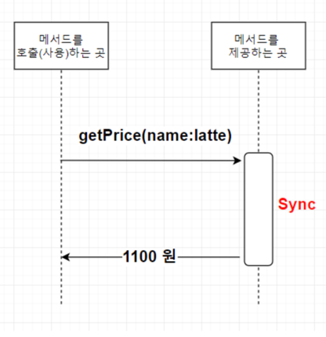
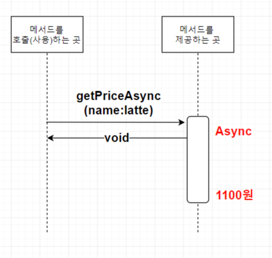
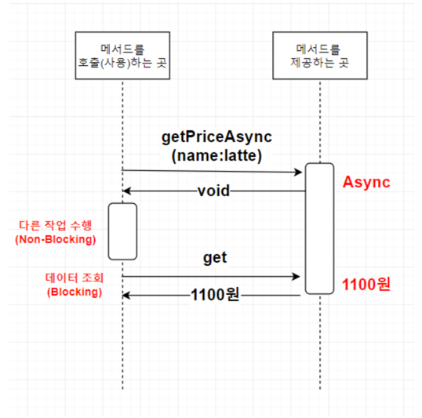
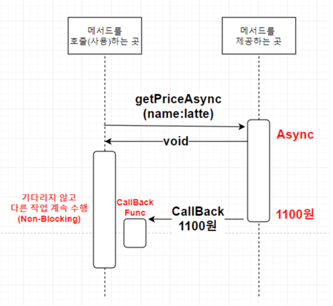

# Sync, Async vs Blocking, Non-Blocking

- 해당 내용은 [brunch 블로그 - CompletableFuture](https://brunch.co.kr/@springboot/267) 글에서 발췌하였다.

## Sync vs Async

### Sync

- 예제를 통해 설명을 시작하겠다.
- 커피 가격을 조회하는 기능을 제공하는 `커피머신`이 있다고 하자.
- 메서드를 제공하는 곳에서는 메서드의 수행이 완료되면 응답을 반환하도록 되어있다.

- 클라이언트에서 커피가격 조회 메서드인 `getPrice`를 호출하였고, 그 결과 `1100원`이라는 결과를 **동기 방식**으로 받았다.
- **동기 방식**은 메서드가 결과를 완성할때까지 응답을 반환하지 않는다.

### Async

- **비동기 방식**은 결과값이 결정되기 전에 일단 응답을 반환 받는다.

- 그림 상으로는 void 로 빈값을 return 받기는 했지만 실제로는 다른 응답값을 받을 수 있다.
- 클라이언트는 메서드 호출 후 임시 응답을 받게 되는데, 그렇다면 언제 실제 응답 결과를 받을 수 있을까?
- 두 가지 방법이 있는데, Blocking, Non-Blocking 을 통해 알아보자.

## Blocking, Non-Blocking

- `Sync, Async` 는 메서드를 **제공하는 곳(Server)에서의 입장**인 반면, `Blocking, Non-Blocking` 은 메서드를 **사용하는 곳(Client)에서의 입장**이다.
- 위 `Async` 에서 설명한 메서드 호출 후 완료된 결과 조회에 대한 두 가지 방법에 대해 이야기 해보자.
- 첫 번째 방법
    - `Async` 메서드는 결과를 완성하기 전에 일단 응답을 반환한다.
    - 그래서 클라이언트는 결과가 완성된 시점에 다시 메서드를 호출하여 결과를 조회해야 한다.
    - 즉, 메서드를 호출한 이후 어느정도 시간이 지난 후 다시 결과를 조회하는 방법이다.

- `getPriceAsync` 메서드 호출 후 클라이언트는 다른 작업을 수행할 수 있다. (Non-Blocking)
- 하지만, 클라이언트가 다른 작업을 수행하다가 메서드 응답결과인 `커피가격`이 필요한 시점에는 다시 데이터를 조회해야 한다.
- 이 때, `get` 메서드를 사용한다고 가정하면, `get` 메서드는 `Sync` 방식으로 빈값이 아닌 실제 결과를 얻어와야 한다.
- 즉, `get` 에서는 응답을 기다려야 한다. (Blocking)
- 메서드를 제공하는 서버 입장에서는 비동기로 구현 했지만 사용하는 클라이언트 입장에서는 항상 논블록킹은 아닌 상황이다.
- 이런 상황을 개선하기 위해 어떻게 하면 좋을까?

### 완벽한 Non-Blocking 구현

- 완벽한 Non-Blocking 구현을 위해서는 `콜백 함수`를 사용해야 한다.
- 즉, 메서드를 제공하는 곳에서 수행 결과가 나왔을 때 이를 클라이언트에게 알려주기 위한 수단이다.

- 클라이언트에서는 결과가 넘어올때까지 차단되지 않고 다른 작업을 계속 수행할 수 있기 때문에 완벽하게 논블록킹으로 동작한다.

## 참고

- https://brunch.co.kr/@springboot/267