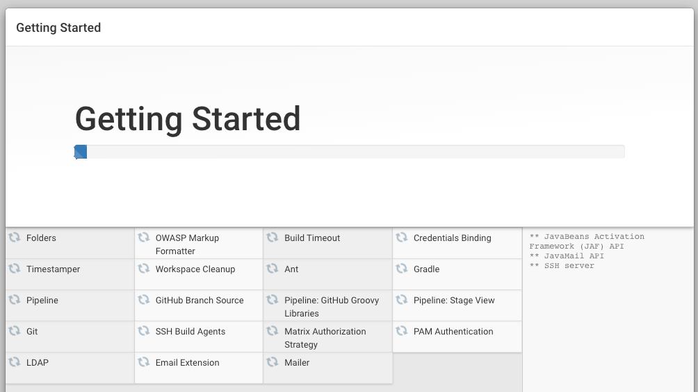
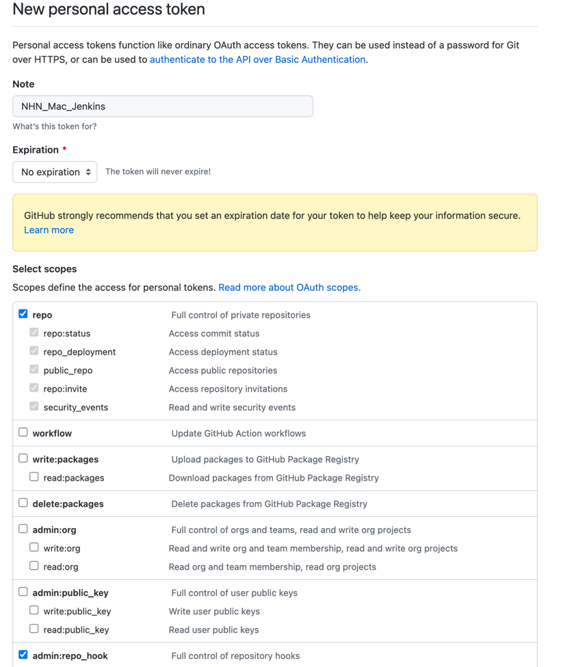
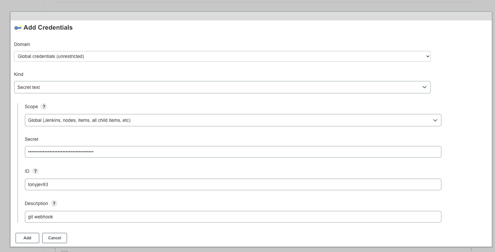
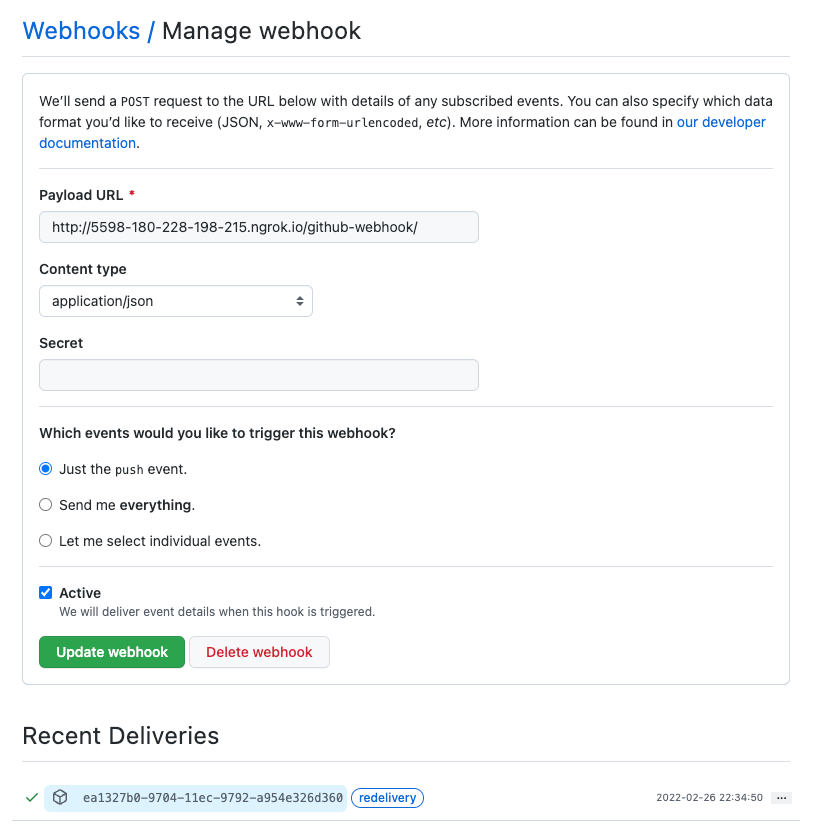
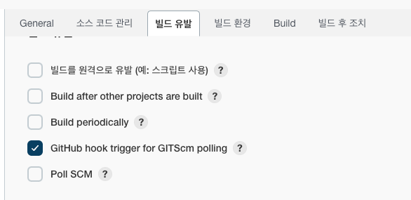
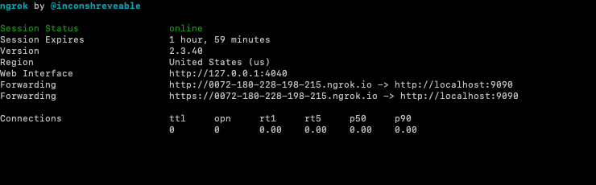
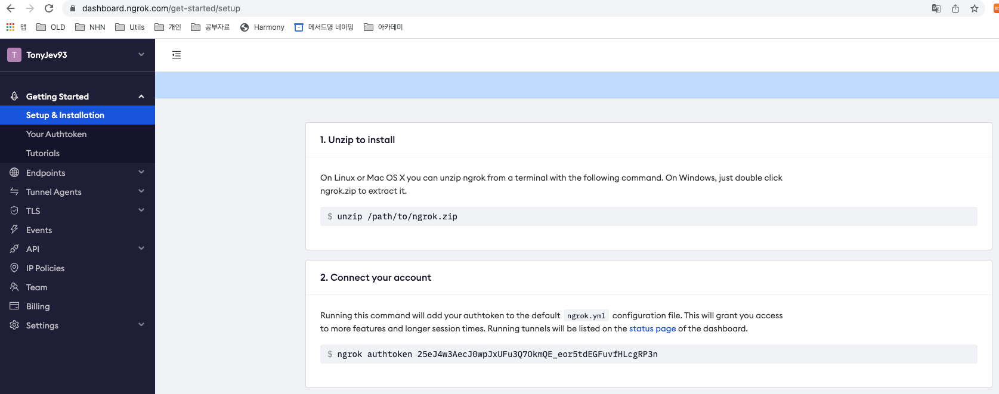

# Jenkins

- Continuous Integration Tools 의 일종
- 무료 오픈소스 자동화 서버
- 빌드, 배포 자동화를 지원하는 다양한 플러그인 제공


## Jenkins Pipeline
- CD(Continuous Delivery) Pipeline
  - 버전 관리에서 소프트웨어를 사용자에게 전달하기 위한 프로세스 자동화
  

## Jenkins 설치
### Mac
- 설치
```bash
# install jenkins
$ brew install jenkins
```

- Port 변경
```bash
# port 변경
$ vi /usr/local/Cellar/jenkins/2.336/homebrew.mxcl.jenkins.plist
```

- 구동 명령어
```bash
$ brew services start jenkins // 젠킨스 시작
$ brew services stop jenkins // 젠킨스 종료
$ brew services restart jenkins //젠킨스 재시작
```


## 기본 설정

- 기본 추천 Plugin 설치



- 어드민 계정 설정 및 URL 설정
- 어드민 아이디 : tonyjev93
- password : r*********
- E-mail : tonyjev93@gmail.com
- URL : http://localhost:9090/

### Git 연동
- 새로운 Item > Item 이름 입력 > `Freestyle project` 클릭 > OK
- 구성 > 소스 코드 관리 > Git Repository 주소 입력


### Webhook 설정
- Git 계정 > Settings > Developer settings > Personal access tokens
  - Note : {Token Name}
  - Select scopes : repo, admin:repo_hook
  


- 생성된 Token 값 저장 및 개인적으로 보관
- Jenkins 관리 > 시스템 설정 > GitHub Server Add - Credentials Add

- Git repository > Settings > Webhooks > add Webhook
  - Payload URL : http(s)://{jenkins 주소}/github-webhook/
  - Content type : json
  - Click : Just the push event, Active



- Jenkins 프로젝트 설정 변경
  - 구성 - 빌드 유발
    

### (참고) ngrok
- local 환경(Wi-Fi 공유기 사용)에서 Webhook 연동 시 local IP를 외부에서 접근 가능하도록 만들어야 함.
  - 방법 : ngrok 사용 or 랜선을 통한 고정 IP 사용
  - [ngrok 사용]
     ```bash 
     # ngrok 설치
     $ brew install ngrok/ngrok/ngrok
     
     # ngrok 실행 - 로컬 주소 받기
     $ ngrok http {Port}
     ```


```vim
                                            [외부 노출 URL]                   [localhost]
Forwarding                    http://0072-180-228-198-215.ngrok.io -> http://localhost:9090
```                                                                                                                                                                                     
- 최초 `http://0072-180-228-198-215.ngrok.io` 접속 시 인증오류 발생 

- ngrok 접속 후 Connect your account 명령어 수행
  - 접속 URL : https://dashboard.ngrok.com/
- ngrok back ground 실행 하기 (terminal 끄면 같이 꺼짐 주의)
```bash
# ngrok 실행
$ ngrok http {port} -log=stdout > ngrok.log &

# 접속 URL 보기
$ tail -f ngrok.log
```


## 참고 
- [Jenkins-Git Webhook 연동](https://yeonyeon.tistory.com/58)