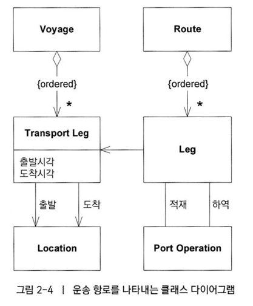
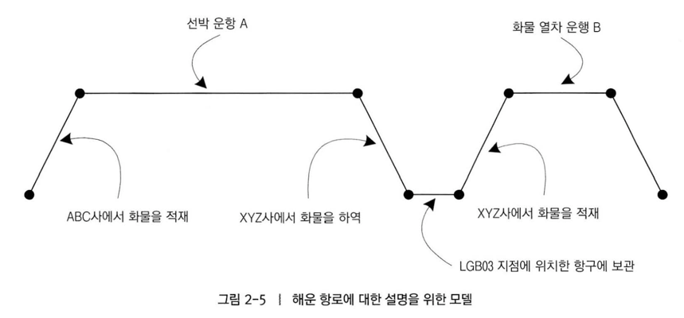

# 도메인주도 설계 - 에릭 에반스

> 소프트웨어의 복잡성을 다루는 지혜

2 장 의사소통과 언어 사용

- page 23
  > 모델은 용어와 관계로 표현된다. 모델 기반 의사소통은 특정 방식으로 한정돼서는 안된다.

- page 24
  > 용어의 번역은 의사소통을 무디게하고 지식 탐구를 빈약하게 만든다.

- page 26
  > 언어가 널리 사용될수록 더욱 원활하게 이해할 수 있다.

  > 팀 전체가 모델 기반 언어에 헌신할 때, 비로소 쓸모 있는 모델을 만들어낼 수 있는 지식탐구 과정이 가능해진다.

  > 언어의 변화는 도메인 모델의 변화로 인식될 것이다.

  > 모든 상황에서 모델 기반 언어를 사용하고 모델 기반 언어가 자연스럽게 느껴질 때까지 끊임없이 노력한다면, 간결한 요소로 복잡한 아이디어를 표현할 수 있는 완전하고 이해하기 쉬운 모델을 만들 수 있다.

- page 27
  > 모델을 언어의 근간으로 사용하라. 의사소통과 코드에 해당 언어를 끊임없이 적용하는데 전념하라. 모든 활동영역에서 동일한 언어를 사용하라.

  > 이름을 다시 지으면서 코드를 리팩터링하라.

  > 유비쿼터스 랭귀지의 변화가 곧 모델의 변화다.

### 크게 소리내어 모델링하기

- page 31
  > 모델을 정제하는 가장 좋은 방법은 큰 소리로 말하기를 통해 살펴보는 것이다.

  > 이야기를 주고받을 때 모델을 사용하라. 시나리오를 큰 소리로 말해보라. 표현해야 할 것을 더 쉽게 말하는 방법을 찾아낸 다음 그러한 새로운 아이디어를 다이어그램과 코드에 적용하라.

### 문서와 다이어그램

- page 36
  > UML 다이어그램은 모델의 가장 중요한 두 가지 측면을 전달할 수 없다.
  > 1. 모델이 나타내는 개념의 의미
  > 2. 모델 내 객체의 행위

  > 다이어그램은 의사소통과 설명의 수단이며 브레인스토밍을 촉진한다. 이러한 목적은 다이어그램이 최소화됐을 때 가장 잘 달성된다.
- page 37
  > 다이어그램의 목적은 모델을 전달하고 설명하는 데 있다. 코드는 설계의 세부사항에 대해 저장소 역할을 한다.

  > 다이어그램은 주의를 집중시키고 모델이나 설계의 각 요소를 참조하는데 도움될 수 있다.

### 글로 쓴 설계 문서

- page 37
  > 어떠한 규모의 집단이든 어느 정도는 글로 쓴 문서로 안정과 공유를 꾀할 필요가 있다.

  > 문서가 일단 어떤 변하지 않는 형태를 취하게 되면, 코드의 발전이나 프로젝트 언어의 발전에 뒤처지는 것이다.

  > 문서는 코드와 말을 보완하는 역할을 해야 한다.
  > - 설계문서로서의 코드에는 한계가 있다.
- page 38
  > 문서는 코드가 이미 잘 하고 있는 것을 하려고 해서는 안 된다.
  > - 문서들은 의미를 설명하고, 대규모 구조에 통찰력을 주며, 핵심 요소에 집중할 필요가 있다.
  > - 프로그래밍 언어가 개념을 직관적으로 구현하는 데 충분하지 않으면 문서를 가지고 설계 의도를 명확하게 나타낼 수 있다.
  > - 글로 쓴 문서는 코드와 논의를 보완해야 한다.

  > 문서는 유효한 상태를 유지하고 최신 내용을 담고 있어야 한다.
- page 39
  > 설계 문서의 가장 큰 가치는 모델의 개념을 설명하고, 코드의 세부사항을 파악해 나가는 데 도움을 주며, 모델의 의도된 사용 방식에 어떤 통찰력을 주는 데 있다.

  > 문서는 프로젝트 활동과 관련을 맺고 있어야 한다.
  > - 이를 판단하는 가장 쉬운 방법은 문서가 유비쿼터스 랭귀지와 상호작용하는지를 살펴보는 것이다.
  > - 설계 문서에 설명된 용어가 대화와 코드에 나타나지 않는다면 문서가 본연의 목적을 수행하지 못하고 있는 셈이다.
  > - 도메인 모델이 업무와 가장 직접적인 관련이 있는 지식을 반영하게 되면, 명세는 더욱 간결하게 쓰여질 수 있는데, 이는 모델 이면에 놓인 업무 지식을 명세에서 전달할 필요가 없기 때문이다.

### 실행 가능한 기반

- page 40
  > 잘 작성된 코드는 의미 전달에 매우 충실할 수 있지만 코드가 전달하는 메시지가 정확하다는 보장은 없다.

  > 올바르게 실행되는 것뿐만 아니라 올바른 의미를 전달하는 코드를 작성하자면 엄청나게 세심한 노력을 기울어야 한다.

### 설명을 위한 모델

- page 41
  > 이 책의 요점은 하나의 모델이 구현, 설계, 의사소통의 기초가 돼야 한다는 것이다. 각 목적에 각기 다른 모델을 갖추는 것은 바람직하지 않다.

  > 모델은 도메인을 가르치는 도구로도 아주 유용할 수 있다. 이러한 목적으로 설계와 무관한 다른 종류의 모델을 전달하는 그림이나 단어를 활용할 수 있다.

  > 다른 모델이 필요한 이유는 범위 때문이다. 기술적 모델은 필요한 최소한의 수준으로 엄격하게 범위를 줄여야 하고, 설명을 위한 모델은 더욱 좁은 범위의 모델을 명확하게 하는 맥락을 제공한다.

  > 설명을 위한 모델에서는 훨씬 더 전달력이 높은 의사소통 방식을 마음껏 만들수 있다. 이는 사람들의 학습에 이바지한다.

  > 설명을 위한 모델은 꼭 객체 모델일 필요는 없으며, 오히려 그렇지 않을 때 더 좋다.

  > 설명을 위한 모델과 설계를 주도하는 모델의 혼동을 피하려면 모든 이가 이 둘의 차이를 의식하고 있어야 한다.
- page 42

  > ### 설계를 위한 모델
  > 
  > - 이와 관련 경험이 없는 사람에게는 클래스 다이어그램이 이해하는 데 별로 도움이 되지 않을지도 모른다.

  > 설명을 위한 모델은 팀원들이 클래스 다이어그램의 실제 의미를 파악하느 데 도움이 될 수 있다.

  > ### 설명을 위한 모델
  > 
  > - 이는 클래스 다이어그램과 상세하게 대응하지 않지만 도메인의 핵심 개념을 밝히는 데 도움을 준다.
  > - 이러한 다이어그램은 그것이 표현하는 모델을 자연어로 설명한 내용과 더불어 개발자와 도메인 전문가가 모두 더욱 엄격하게 표현된 소프트웨어 모델 다이어그램을 이해하는 데 도움될 수 있다.

