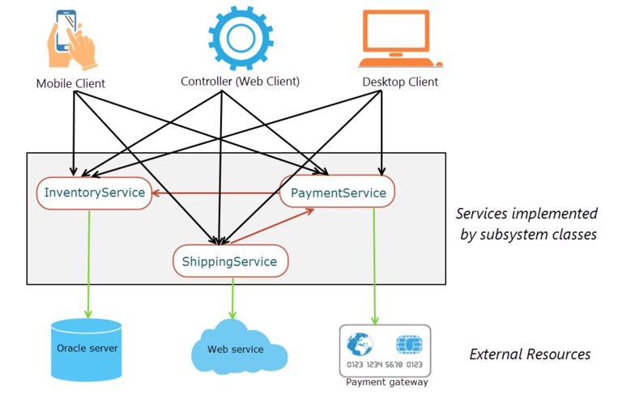
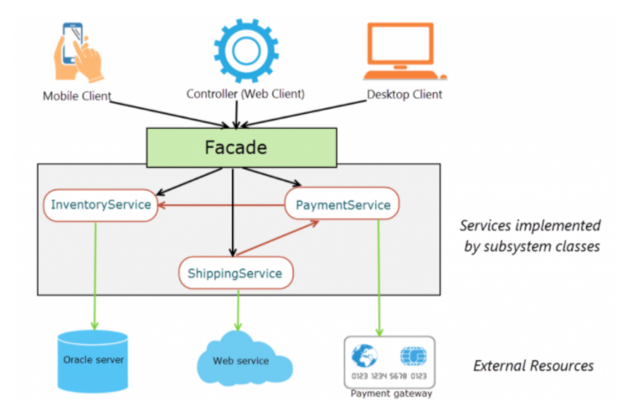

# Facade Pattern

- Facade = (건물의)정면 또는 외관
- 어떠한 서브 시스템의 일련의 인터페이스에 대해 통합된 인터페이스를 제공하는 방법
- `Client`에게 오직 `건물의 외관(Facade)`만 제공하고, `건물의 구성(서브 클래스)`는 감추는 기법 정도로 이해하면 될 듯 싶다.
    - 그럼 **인터페이스**랑 다를게 뭐지..?
        - `Facade` 도 인터페이스인데, `Subsystem`에 있는 **인터페이스들에 대한 통합된 인터페이스**이다.
        - `Subsystem`을 더 쉽게 사용할 수 있도록 만드는 **더 높은 수준의 인터페이스**를 말한다.

## 역할

- **Facade** : `Client`의 요청을 받아 적절한 서브 시스템으로 전달(중계자)하는 역할
- **Subsystem** : `Subsystem` 기능 구현체, `Facade` 에 의해서만 사용된다.
- **Client** : `Facade` 에게 특정 기능을 요청하는 역할.

## Facade 적용 전 VS 후

### Facade 적용 전

 _- 출처 : https://springframework.guru/gang-of-four-design-patterns/facade-pattern_

- `Client`가 필요한 기능들을 `Subsystem` 에 직접 접근하여 호출한다.
    - `Subsystem`의 정보를 `Client`가 알고있어야 함
    - 이는 `Client`와 `Subsystem`간의 강한 결합을 형성한다.
    - `Subsystem` 변경이 `Client` 에 영향을 줄 수 있음.
- 하나의 요청에 여러 `Subsystem` 호출이 필요한 경우 `Client` 단에서 여러번의 호출을 수행함.
    - 특정 요청을 위해 어떤 `Subsystem` 이 호출되어야 하는지를 `Client`가 일일이 알고 있어야함.
    - 서로다른 `Client`에서 동일한 기능을 수행하고 싶을 때 재사용이 불가능하고 서로 다른 구현이 나올 수 있음.

### Facade 적용 후

 _- 출처 : https://springframework.guru/gang-of-four-design-patterns/facade-pattern_

- `Client`가 원하는 것은 `주문`을 넣는 것이지, `inventory, shipping, payment` 에 대해서는 관심이 없다.
- `Facade(interface)`내에서 적절한 서비스 호출을 통해 내부 구현을 외부로부터 숨기고 원하는 요청을 명시할 수 있게 되었다.
- 이제 `Subsystem` 에 변화가 생기더라도 `Client`에는 변경이 필요하지 않게 되었다.

---

## Facade vs Adapter

- `Facade Patter` 의 목적 서브시스템과의 상호작용 복잡도를 낮추는 것
- `Adapter Pattern` 은 클라이언트가 사용하고자 하는 다른 인터페이스로 기존의 인터페이스를 조정하는 것

## Facade vs Front-Controller

### Facade

- `Facade` 는 내부 시스템의 복잡도를 감추기 위해 **복잡한 기능을 감싸고** 상호작용할 **더 단순한 메서드를 제공**하는 계층
- 클라이언트의 `요구사항` 을 해결할 수 있도록 내부 시스템을 적절히 이용하여 구현한다. `요구사항` 외의 기능을 포함해서는 안된다.

### Front-Controller

- 컨틀롤러의 경우 컨트롤러 자체가 자신만의 로직을 가질 수 있음.
- 또한, `Front-Controller`의 **목적**은 내부 시스템의 **복잡도를 감추기 위함보다는** 모든 요청에 대해 공통적으로 처리되도록 **외부에 공개하는 것**이다.
- 따라서 `Facade`와 근본적인 목적의 차이점이 존재한다. (단일 책임의 원칙)

--- 

## 고찰

- 언제쓰면 좋을까?
    - 단일 서비스를 호출하는 경우에는 바로 서비스를, 여러 서비스를 호출하는 경우 Facade 를 사용하면 될 것 같다.
- Facade 에 너무 많은 로직이 들어가면 책임이 과해지면서 본질(서브 시스템에 대한 복잡도를 감추기 위함)을 잃게 되는 것 같다.
- 그러니깐, Facade 보다는 Subsystem 에 더 많은 책임을 부여하고 Facade 는 정말 중계자 역할을 수행할 수 있도록 노력하자!

---

## 참고

- https://www.tutorialspoint.com/design_pattern/facade_pattern.htm
- https://live-everyday.tistory.com/210
