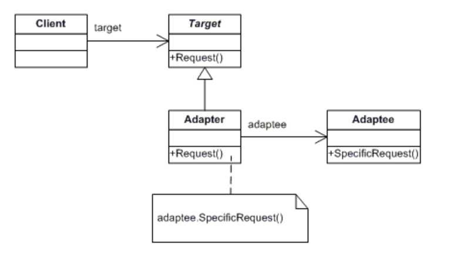
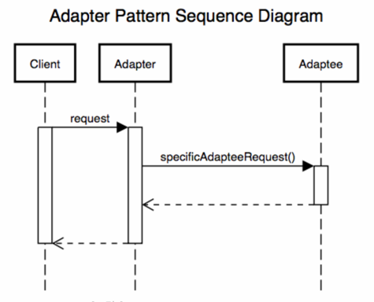

# 어댑터 패턴

- 어댑터 패턴은 이름대로 어댑터처럼 사용되는 패턴이다.
- 220V 를 사용하는 한국에서 쓰던 기기들을 어댑터를 사용하면 110V 를 쓰는곳에서도 사용할 수 있다.
- 이처럼, 호환성이 없는 인터페이스 때문에 함께 동작할 수 없는 클래스들이 함께 작동하도록 해주는 패턴이 어댑터 패턴이다.

## 장점

- 관계가 없는 인터페이스 간 같이 사용 가능
- 프로그램 검사 용이
- 클래스 재활용성 증가

## 이용

- 기존 시스템에 새로운 써드파티 라이브러리가 추가되거나, 레거시 인터페이스를 새로운 인터페이스로 교체하는 경우 코드의 재사용성을 높일 수 있는 방법으로 이용 됨.

## 구조



### 역할

- **Client** : 써드파티 라이브러리나 외부시스템을 사용하려는 쪽
- **Adaptee** : 써드파티 라이브러리나 외부시스템을 의미
- **Target**(I/F) : Adapter 가 구현하는 인터페이스. 클라이언트는 Target 를 통해 Adaptee 인 써드파티 라이브러리를 사용하게 됨.
- **Adapter** : Client 와 Adaptee 중간에서 호환성이 없는 둘을 연결해주는 역할 담당. Target 을 구현하며, 클라이언트는 Target 을 통해 어댑터에 요청을 보냄. 어댑터는 요청을
  Adaptee 가 이해할 수 있는 방법으로 전달하여 Adaptee 에서 처리가 이루어지도록 함.

### 호출 과정



- Client 의 요청은 Adapter 가 받았지만 실질적인 처리는 Adapter 가 감싸고있는 Adaptee 에게 위임한다.
- Adapter 가 Adaptee 를 감싸고 있기 때문에 `Wrapper 패턴` 이라고도 불린다.

## 예시

- 시나리오 설명
    - `WebClient`가 `WebRequester` 인터페이스의 `requestHandler`함수를 통해 외부에 요청을 보내는 기능을 구현하고있다.
    - `WebRequester`는 `OldWebRequester`를 통해 구현되었다.
    - 그러나 요구사항이 변경되어 `OldWebRequester`가 아닌 `FancyRequester`를 사용해야 된다.
    - 문제는 `FancyRequester`의 경우 기존의 `WebClient`가 사용하던 `requestHandler`함수가 아닌 `fancyRequestHandler`를 통해 호출하도록 되어있다.
    - 이를 해결하기 위해서는 아래와 같은 방법들이 있을 것 이다.
        1) `WebClient`에서 `FancyRequester`를 사용하도록 수정 -> 클라이언트 소스 변경 필요.
        2) `FancyRequester`의 함수명을 `requestHandler`로 변경 -> `FancyRequester`를 사용하는 모든 클라이언트의 소스 변경 필요.(
           또한, `FancyRequester`가 오픈소스가 아닌 컴파일된 바이너리 파일인 경우 직접적인 접근 불가로 수정 불가능.)
        3) `WebClient`에서 `WebRequester`인터페이스 사용을 유지하고, `WebRequester`의 구현체로 `WebAdapter`를 신규로 생성한다. 그리고 `WebAdapter`
           에서 `FancyRequester`를 호출하도록 한다. -> 클라이언트 소스 유지 & Adaptee 소스 유지 (어댑터 패턴)

### WebRequester <I/F>

```java
public interface WebRequester {
    void requestHandler();
}
```

### Web Client

```java
public class WebClient {
    private WebRequester webRequester;

    public WebClient(WebRequester webRequester) {
        this.webRequester = webRequester;
    }

    public void doWork() {
        webRequester.requestHandler();
    }
}
```

### OldWebRequester

```java
public class OldWebRequester implements WebRequester {
    @Override
    public void requestHandler() {
        System.out.println("OldWebRequester is working");
    }
}
```

### FancyRequester

```java
public class FancyRequester {
    public void fancyRequestHandler() {
        System.out.println("Yay! fancyRequestHandler is called!");
    }
}
```

### WebAdapter

```java
public class WebAdapter implements WebRequester {
    private FancyRequester fancyRequester;

    public WebAdapter(FancyRequester fancyRequester) {
        this.fancyRequester = fancyRequester;
    }

    @Override
    public void requestHandler() {
        fancyRequester.fancyRequestHandler();
    }
}
```

### 실행

```java
public class AdapterDemo {
    public static void main(String[] args) {
        WebAdapter adapter = new WebAdapter(new FancyRequester());
        WebClient client = new WebClient(adapter);
        client.doWork();
    }
}
```

---

## 고찰

- 어댑터 패턴에 대해 체감되는 간단한 느낌은, `말을 옮겨주는 역할`이다. 상대가 못알아 듣는 말을 중간에 `어댑터`가 알아들을 수 있게 변경해서 전달하는 역할을 수행한다고 생각한다.
- 그렇기 때문에 말을 하는 사람은 어댑터에게 기존 방식대로 본인의 말을 하면 되는거고, 듣는 사람도 기존 방식대로 듣기만 하면 된다. 중간에 어댑터가 열심히 바꿔서 말해주기 때문이다.
- 이런 패턴은 실무에서 어떻게 적용할 수 있을까 생각해 보면,
    - PG 사
        - 현실 세계에서 `PG 사`가 어댑터의 역할을 하고 있는게 아닌가 싶다.
        - 우리는 결제할 `카드사`를 고르고 결제정보를 `PG 사`에 넘긴다.
        - `PG 사`는 우리 대신 결제정보를 `카드사`에 알맞는 형식으로 변환하여 전달한다.
        - 즉, 우리는 `카드사`가 새로 생기든 말든 `PG 사`에 동일한 방식으로 요청을 보내면 되고, `카드사`도 기존 방식을 유지한체 `PG 사`가 맞추도록 하면 된다.
        - 그럼 가운데 있는 `PG 사` 빼고 모두 해피해피한 상황이 연출된다.
    - DB Query Util
        - 실무에서 DB 의존적인 Function 을 호출 할 때가 종종 있다.
        - 예를 들면, JSON 내 특정 데이터를 추출하는 Function 에 대해 MySql 에서는 `JSON_EXTRACT`를 Oracle 에서는 `JSON_VALUE`라는 함수명을 사용한다.
        - 만약, 처음에 MySql 을 사용하고 있어서 호출 함수명이 `jsonExtract()` 였다고 가정하자.
        - 그런데 갑자기 Oracle 로 전환해야 하는 일이 발생하면 함수명이 `jsonValue()` 로 변경되어야 한다.
        - 그러나 `Adapter`를 사용한다면 클라이언트에서 `jsonExtract()`는 그대로 사용하고, `Adapter`가 중간에서 호출하는 함수를 갈아 끼워주면서 Oracle
          의 `jsonValue()`를 그대로 사용할 수 있게 된다.

## 참고

- https://yaboong.github.io/design-pattern/2018/10/15/adapter-pattern/
- https://howtodoinjava.com/design-patterns/structural/adapter-design-pattern-in-java/