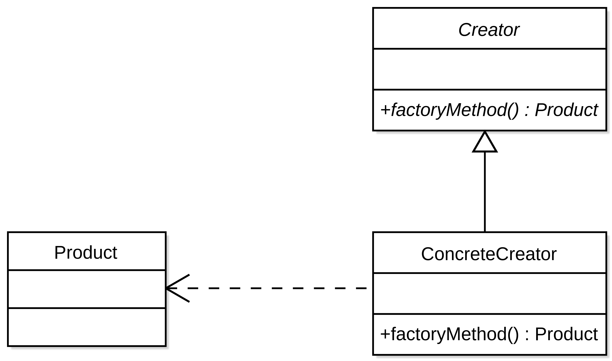

# 팩토리 메서드 패턴

- 객체를 생성하기 위해 `인터페이스`를 만든다.
- 어떤 클래스의 인스턴스를 만들지를 `서브클래스`에게 결정하도록 한다.
- `팩토리 메서드`를 이용하면 **인스턴스를 만드는 일**을 `서브클래스`로 미룰 수 있다.


<br>_- [이미지 출처](https://ko.wikipedia.org/wiki/%ED%8C%A9%ED%86%A0%EB%A6%AC_%EB%A9%94%EC%84%9C%EB%93%9C_%ED%8C%A8%ED%84%B4#/media/%ED%8C%8C%EC%9D%BC:FactoryMethod.svg)_

## 아무말

- `팩토리 메서드` 낱말 풀이
    - `팩토리` : 공장, 만든다, Input -> Output
    - `메서드` : 함수, 호출하여 사용, Input -> Output
    - 합치면? : Output 을 생성하는 함수. (무엇을? 인스턴스를)

- 이해한 바.
    - 인터페이스를 통해 `팩토리 메서드`를 제공.
        - 왜 인터페이스 사용?
            - `사용할 함수(팩토리 메서드)`는 고정하고 싶고
                - 즉, `Input / Output` 도 고정
            - 생성하는 과정은 다양하고 싶어서
    - 해당 인터페이스를 구현한 구현체는 어떤 녀석들?
        - Only, 인터페이스에서 지정한 `Output` **생성을 목적**으로 한 `Class`들

## 자문자답

- 사용할 때와 사용하지 않았을 때의 차이점은?
    - 예시) 피자를 만드는 가게 Class
        - 가게 종류 : 피자헛 가게, 도미노 피자 가게, 미스터 피자 가게
        - 각 가게마다 본인 가게에 해당하는 피자를 생성해야 함
    - **사용 안했을 때**
        - 피자헛_피자 = 피자헛_가게.피자헛_피자생성
        - 도미노_피자 = 도미노_피자가게.도미노_피자생성
        - 미스터_피자 = 미스터_피자가게.미스터_피자생성
    - **사용 했을 때**
        - 피자 = 피자가게.피자생성
        - 사용 했을 때는 DI 를 통해 원소스 변경없이 클라이언트 쪽에서 유연하게 원하는 피자를 생성할 수 있음. (DIP)
    - **그럼 이게 목적인건가???**
        1) 클라이언트 쪽 코드가 일관/통일성 있어짐
        2) OCP, DIP 를 지킴


- 어떤 상황에서 사용하면 될까?
    - 사용을 하긴 해야할텐데.. 언제?
        - 동일 속성을 띄는 응답 클래스가 다양한 경우
        - ex) 도서 -> 어린이 도서, 성인 도서, 웹툰 ...
            - 동일 속성 : 저자, 작성일, 전체 페이지수 ...
            - 다른 속성
                - 어린이 도서 : 출판사, 교육 자료, 연령 제한
                - 성인 도서 : 출판사, 연령 제한
                - 웹툰 : 모르겠음 . 뭐 특징적인 속성이 있겠지?
            - 이런 상황속에서 책 생성하는 `팩토리 메서드`를 둔다?
          ```java
                public interface BookGenerator {
                    Book create();
                }
                
                // 어린이 도서
                public class KidsBookGenerator implements BookGenerator {
                    Book create() {
                        return new KidsBook();
                    }         
                }
          
                // 성인 도서
                public class AdultBookGenerator implements BookGenerator {
                    Book create() {
                        return new AdultBook();
                    }         
                }
          ```
            - 굳이..? 그냥 Book 안에 속성값으로 BookType 을 두고 Book 클래스에서 static Factory Method 를 사용할 것 같은데
                - 앗, 그러면 각각의 Book 종류 마다 가지고 있는 고유의 속성들이 모두 가져야 하는 상황이 발생하겠구나.. 생각이 짧았다
                - 그치만, 모든 속성이 다 같지만 생성할 때 로직만 다르다면?!?
                  - static Factory Method 를 통해 `createKidsBook`, `createAdultBook`, `createWebtoon`과 같이 각자 구현체를 만드는 방법도 있을 것 같다.
                  - 그치만, Factory Method 인터페이스를 뽑아내는것이 더욱 응집력 있어 보이긴 하겠다. SRP도 있어보이려나?
        - 그렇다면 결제쪽도?
          - PaymentGenerator
            - Payment
            - Refund-All
            - Refund-Part
            - Cancel
          - 고려해볼만 하겠군..
          - 패키지 위치는 어디가 적절할까? 도메인 Layer 에 같이 두고 있으면 되려나? 이게 바로 Helper 클래스인가..?
## 고찰

- 처음에는 느낌이 애매했는데 생각을 정리하면서 어떻게 사용할지 고민하다보니, 잘 찾아보면 은근히 사용할 만한 구석이 있을 것 같다.
- `static Factory Method` 와 유사점이 많아 보이는데, `static Factory Method`가 너무 많아진다면 `interface`로 추출하는 것도 고려해볼만 할 것 같다.