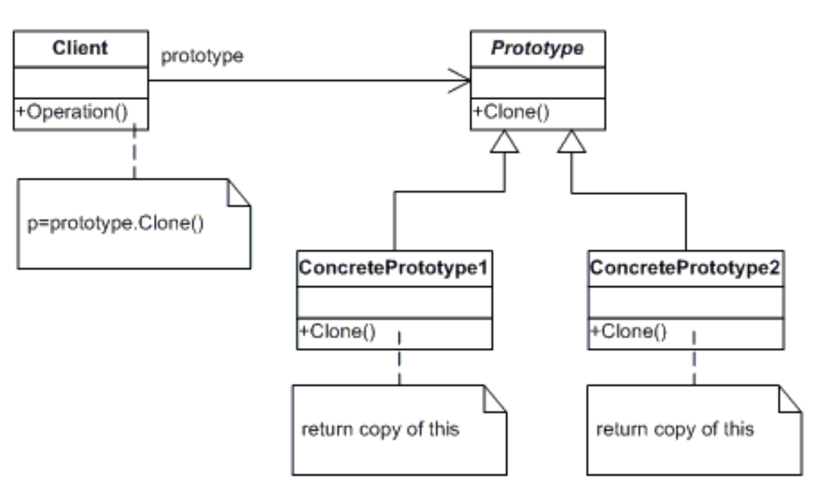

# 프로토타입 패턴

- `프로토타입`은 실제 제품을 만들기에 앞서 대략적인 샘플정도의 의미로 사용되는 단어
- `프로토타입 패턴`은 객체를 생성하는데 비용(시간과 자원)이 많이 들고, 비슷한 객체가 이미 있는 경우에 사용되는 생성 패턴 중 하나다.
- `프로토타입 패턴`은 Original 객체를 새로운 객체에서 복사하여 우리의 필요에 따라 수정하는 메커니즘을 제공한다.
- 이 패턴은 복사를 위해 JAVA 에서 제공하는 `clone()` 을 사용한다.

## 사용 방법

- `프로토타입 패턴`은 `clone()`을 이용하기 때문에 **생성하고자 하는 객체**에 `clone()`에 대한 Override 가 필요하다.
- `clone()` 메소드 사용을 위해 `Cloneable` 인터페이스를 구현해야 한다.

### 활용 - DB 데이터 복제하여 사용

    - DB 로부터 읽어온 동일 데이터를 수차례 수정하여 사용해야 하는 경우
    - 매번 DB 로부터 데이터를 불러오는 것은 비용이 많이 든다.
    - 따라서, 한번 불러온 데이터를 새로운 객체에 복사하여 이를 사용하는 방법이 더욱 효율적이다.
    - 이 때 객체에 대한 복사를 얕은 복사로 할 지, 깊은 복사로 할 지에 대해 선택하면 된다.

## 고찰
- `프로토타입 패턴` 을 실무에서 의식적으로 사용해본 적은 없는것 같다.
- 아마도 `프로토타입 패턴`인줄 모르고 무의식중에 사용하는 경우는 많은것 같다.
- 예를 들면, `Entity <-> DTO` 변환의 경우도 어떻게 보면 원형(prototype)의 객체가 복제되어 동일 성격의 다른 객체로 생성되는 것이 `프로토타입 패턴`의 사상과 일치하지 않을까 생각한다.
- 물론, `프로토타입 패턴` 관련 설명중 `동일 타입으로의 Clone` 밖에 못보긴 했지만 반대로 `다른 타입으로의 Clone을 하면 안된다.`라는 말도 못봤기 때문에 그 패턴의 사상만 일치한다면 잘 활용한거지 않을까 싶다.
