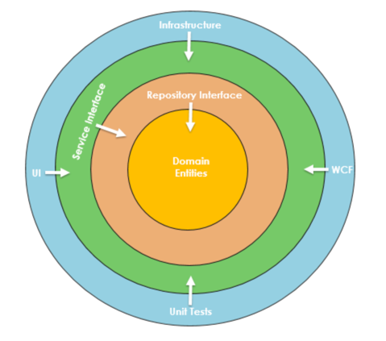

# Onion Architecture

## Onion Architecture 란?
- Introduced by Jeffrey Palermo
- For better testability, maintainability, and dependability

## 원리
- IoC에 기반을 둠
- Multiple Concentric(동심) Layer 구조로 되어있음
- 각 Layer 간의 인터페이스를 두고 있음
- Core Layer 는 Domain 을 담고 있음
- 기존 Multi-tier 구조 방식과 달리 Data Layer 에 의존하지 않고, 실질적인 도메인 모델에 의존한다. 

## 특징
- 출처 : https://www.codeguru.com/csharp/understanding-onion-architecture/

- 기존 구조(3 & n-tier)는 상호 Layer 간의 강한 의존성을 갖는 문제점이 있었음.
- Onion Architecture 는 Domain 부터 Infrastructure 까지의 Layer 를 정의하므로서 위 문제점 해결
- 이는 모든 커플링 방향이 중심으로 향한다는 근본적인 규칙을 적용한 것이다.
- 이는 모든 다른것들 뒤에 Object 를 두는 OOP 를 향하도록 하는 규칙이다.
- 중심에는 비즈니스 및 행동 객체를 대표하는 도메인 모델이 존재한다.

----

## 구성

- Onion Architecture 를 구성하기 위한 Layer 들은 무엇이 있을까?

### Domain Layer
- 중심에 위치
- Business and behavior Object 를 대표
- 모든 도메인 객체는 해당 코어에 존재하도록 하는 사상을 지님
- 모든 Application 의 도메인을 지니고 있음
- 각 도메인들은 어떠한 의존성도 지니고 있지 않음
- 도메인 객체는 또한 대량의 코드와 의존성 없이 Flat 해야만 한다.

### Repository Layer
- 해당 Layer 는 Domain Entity 들과 Application 의 Business logic 사이의 추상화 되어 존재한다.
- 해당 Layer 는 전형적으로 DB 에 데이터 저장 및 조회를 위한 인터페이스를 제공한다.
- 데이터 접근에 느슨하게 연관된 DB 접근 패턴으로 구성되어 있음
- Business entity <-> Data source 맵핑 

### Service Layer
- Application 의 서비스단 비즈니스 로직을 수행
- UI Layer <-> Repository Layer 중계역할 
- 해당 레이어는 Service Interface 와 Implementation 을 분리하여 관리한다.
- 이는 느슨한 연관관계와 관심사 분리를 가능하게 하기위함

## 구현
- 해당 아키텍처는 각 Layer 를 구현하기 위한 어떠한 가이드라인도 제공하지 않는다.
- 설계자가 자유롭게 구현하면 됨

### UI Layer
- 가장 바깥에 존재하는 Layer
- UI 또는 Test 와 같은 주변 관심사를 제공
- Web Application -> Web API or Unit Test Project
- 느슨한 연결 구조를 유지하고 인터페이스를 통한 내부 Layer 와의 통신을 위해 Dependency Injection Principle 가 구현한 Layer

----

## 장단점

### 장점
- 각 계층은 Interface 를 통해 연결되어 있으며, Run-time 에 구현체가 제공된다.
- DB 접근 or 서비스 호출과 같은 모든 외부 의존성이 External Layer 에서 표현된다.
- 내부 Layer 와 외부 Layer 가 서로 독립적이다.
- 연결 방향이 중심을 향한다.
- 유연하고 지속적이며 이식성 좋은 아키텍처다.
- 공통/공유 프로젝트를 생성할 필요가 없다.
- Application Core 가 어떠한 의존성도 없기에 빠르게 테스트할 수 있음

### 단점
- 초보자에게 이해하기 어려운 구조
- 러닝커브가 존재
- 설계자가 주로 Layer 간의 책임 분할을 엉망으로 만듦
- 과한 Interface 사용

--- 
## 결론
- 해당 아키텍처는 서로 다른 두 아키텍처(Layered & Hexagonal)과 연관되어 있다.
- 해당 아키텍처는 Java 보다는 C# 에서 더욱 자주 사용 된다.
- 그치만, 해당 아키텍처를 사용할지 말지는 설계자의 몫이다.

----
## 참고
- [개념설명](https://www.codeguru.com/csharp/understanding-onion-architecture/)